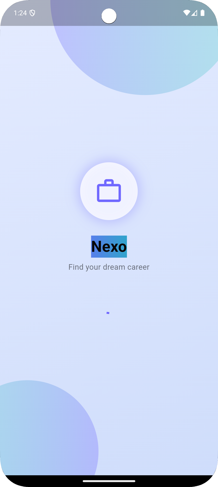

# EraAI51 Nexo


Nexo is a modern Flutter application designed to help users manage their career journey. The app integrates with Firebase and provides a seamless experience for job seekers, featuring:

- **Job Listings:** Browse and search for job opportunities
- **Applications Management:** Track your job applications
- **CV (Resume) Management:** Create and update your professional CV
- **User Profile:** Manage your personal and professional information
- **Secure Authentication:** Safe and reliable login
- **Light & Dark Theme:** Adaptive UI for all preferences

## Features

- Built with Flutter, Riverpod, and Firebase
- Clean, intuitive, and responsive UI
- Modular architecture for scalability
- Cross-platform: Android, iOS, Web, Desktop

## Getting Started

### Prerequisites
- [Flutter SDK](https://flutter.dev/docs/get-started/install)
- [Firebase account](https://firebase.google.com/)

### Installation
1. Clone the repository:
   ```bash
   git clone <your-repo-url>
   cd nexo
   ```
2. Install dependencies:
   ```bash
   flutter pub get
   ```
3. Set up Firebase:
   - Add your `google-services.json` (Android) and `GoogleService-Info.plist` (iOS) in the respective folders.
4. Run the app:
   ```bash
   flutter run
   ```

## Folder Structure

```
lib/
  core/         # Core utilities, themes, shared widgets
  feature/      # Feature modules (login, dashboard, etc.)
  main.dart     # App entry point
```

## Screenshots
 |  |  |  |

## Contributing

Contributions are welcome! Please open issues and submit pull requests for improvements.

## Contact

For support or business inquiries, contact [jahannira@gmail.com](mailto:jahannira@gmail.com).

